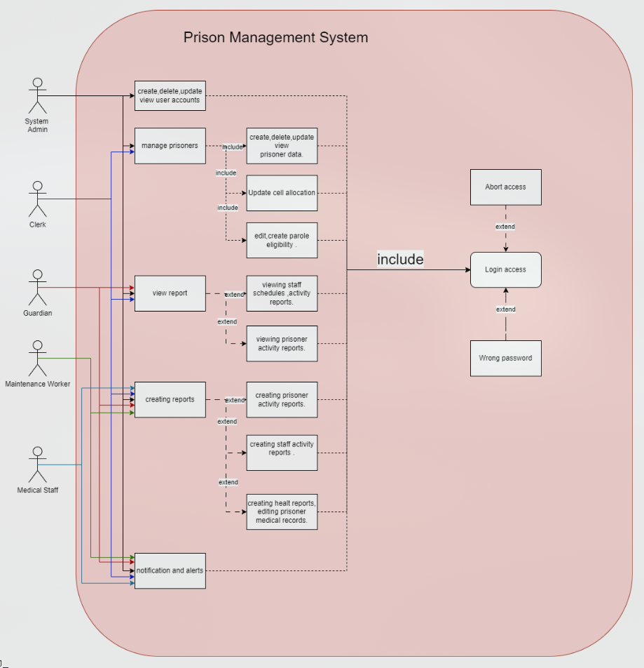

# Prison Management System

### Dokuz Eylül University – Department of Computer Engineering

#### Course Project – Object-Oriented Programming

---

## 📝 Project Info

**Project Title**: Prison Management System  
**Course Instructor**: Prof. Dr. Semih Utku  
**Course Code**: CSE-2210

---

## 🧭 Table of Contents

- [Overview](#-overview)
- [Features](#-features)
- [System Requirements](#-system-requirements)
- [Technologies Used](#-technologies-used)
- [Architecture](#-architecture)
- [Use Cases](#-use-cases)
    - [Use Case Diagram](#use-case-diagram)
- [License](#-license)

---

## 📖 Overview

The **Prison Management System** is a modular and scalable desktop application developed to optimize the daily
operations of prison staff.
The system focuses on centralized prisoner and staff management, cell allocation, visitor tracking, and report
generation.
**PMS** aims to increase **security**, **efficiency**, and **productivity** of prison environments by transition from
manual systems to structured, secure digital processes.

---

## 🔧 Features

- **Prisoner Management**: Register and manage detailed information about each prisoner.
- **Staff Management**: Assign and manage staff members, including their user credentials.
- **Visitor Management**: Track and manage each visit history of each prisoner.
- **Cell Allocation**: Allocate prisoners to cells and manage cell capacities.
- **Role-Based Access**: Permissions to access specific features based on the user's role.
- **Secure Authentication**: Encrypted credentials and role-sensitive access.
- **Performance-Oriented**: Optimized for performance and scalability.

---

## 💻 System Requirements

- **Java Version**: 17 or higher
- **Operating System**: Windows, Linux, or macOS

---

## 🛠 Technologies Used

- **Language**: Java
- **Encryption**: SHA-256 for password hashing
- **Version Control**: Git

---

## 🏗 Architecture

- **Modular Design**: Each functionality (prisoners, staff, visits, etc.) exists as an independent module for easy
  maintenance and scalability.
- **Role-Based Access Control**: Users access only what is allowed based on their role.
- **Encryption**: Passwords are hashed using SHA-256 for secure storage and transmission.

---

## 📝 Use Cases

| Use Case               | Role      | Description                                             |
|------------------------|-----------|---------------------------------------------------------|
| Staff Login            | All Staff | Login with username and password to access the system.  |
| Update Staffs          | Admin     | Add or modify staff accounts and permissions.           |
| View Prisoner Info     | Guard     | View prisoner records and logs without editing.         |
| Add New Prisoner       | Clerk     | Enter personal, legal, and cell data of a new prisoner. |
| Register Visitor       | Clerk     | Log visitors and schedule visits.                       |
| Update Cell Allocation | Clerk     | Reassign prisoners to different cells.                  |

### Use Case Diagram

---

## 📜 License

This project is licensed under the MIT License - see
the [LICENSE](https://github.com/Dertanzer123/OOP-Project/blob/main/LICENSE) file for details.